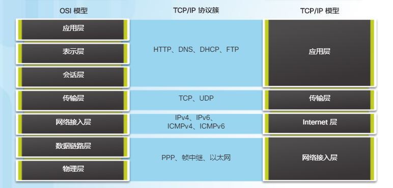

# 网络协议和通信

## 通信规则

### 规则

* 通信要素包括: 消息来源, 目的地址, 通道
* 协议要对以下要求做出说明
  * 标识发送方, 接收方
  * 语言和语法
  * 传递的速度和时间
  * 证实或确认要求

* 消息编码
  * 适合介质
* 消息格式与封装
  * 称为**帧**
  * 目的地址和源主机的地址
* 消息大小
* 消息时序
  * 访问方法: 消息发送的时间以及发生冲突的响应方式
  * 流量控制: 信息量和发送速度
  * 响应超时: 没有及时回复的操作
* 消息传输
  * 单播: 一对一, 只有一个目的地址
  * 组播: 一对多, 发送同一条消息到一组主机
  * 广播: 发送消息到所有主机

## 网络协议与标准

### 协议

* 协议簇: 执行某种通信功能所需的一组内在相关协议, 在通讯涉及到的软硬件中实施

* 网络协议
  * 协议是为了让发送接收方都理解信息。
  * 消息格式化/结构化
  * 网络设备与其他网络贡献路径信息
  * 传送错误信息与系统消息的方式与使劲啊
  * 网络通道建立和拆除
  
* 协议交互: 示例: web服务器和客户端

  * 应用层-HTTP(超文本传输协议)
  * 传输层-TCP(传输控制协议), TCP将HTTP消息划分为小片段(数据段), 控制消息大小和传输速率
  * 互联网层-IP(Internet 协议), 从TCP获得格式化数据段, 封装成为数据包, 分配地址, 传送到目标主机
  * 网络接入层-以太网, 网络访问协议, 包括数据链路上的通信和网络介质中数据的物理传输. 接受来自IP的数据包, 封装称为介质传输的格式

  

### TCP/IP协议簇

* 协议分层: 不同厂商专注于自己的层, 层之间的交互方式是固定的. TCP/IP协议簇包括: 应用层-传输层-互联网层-网络接入层.
* TCP/IP协议簇被作为TCP/IP协议栈来实施, 通过网络为应用程序提供给端到端的传送. 以太网协议用于通过 LAN 使用的物理介质传输 IP 数据包
* 不同层的常用协议
  * 应用层
    * DNS, 域名系统
    * DHCP, 动态主机配置协议, 动态分配/回收ip
    * SMTP(简单邮件传输协议, 客户端或服务器发送邮件), POP3(邮局协议, 检索和下载邮件), IMAP(Internet 消息访问协议, 访问存储在邮件服务器中的邮件, 维护电子邮件)
    * FTP(文件传输协议, 确认传输结果, 可靠, 面向连接), TFTP(简单文件传输协议, 无连接, 五确认, 比FTP占用资源少)
    * HTTP, 超文本传输协议
  * 传输层
    * UDP, 用户数据报协议, 不确认数据传输是否成功
    * TCP, 确认成功传输, 可靠
  * 互联网层
    * IP, 从传输层接收消息段, 打包为数据包, 数据包在网络上端对端传输.
    * NAT, 将私有网络IP地址转化为公有IP地址
    * ICMP, Internet控制消息协议, 反馈数据包传输过程中的错误
    * OSPF, 开放最短路径优先, 路由协议
    * EIGRP, 增强型内部网关路由协议, 综合度量带宽, 延迟, 负载, 可靠性
  * 网络接入层
    * ARP, 地址解析(resolution)协议, 查询局域网IP地址对应的MAC地址
    * PPP, 点对点协议
    * 以太网, 网络接入层的布线标准, 信令标准
    * 接口驱动程序
* TCP/IP通信过程, 以HTTP为例
  * HTTP将报头添加到HTML数据前面, 把HTML格式的网页数据传给传输层
  * TCP传输层协议管理当个会话
  * 将IP信息添加到TCP信息前, 形成**IP数据包**
  * 以太网协议添加到IP数据包两端, 形成**数据链路帧**

### 标准组织

* IEEE, 电气电子工程师协会
* ISOC
* TIA, 电信工业协会(网线排列的协议), TIA/EIA协议
* EIA, 美国电子工业协会(网线排列的协议)
* ......

### 参考模型

* OSI模型, 用层的编号代替名称, 第一层指物理层, 第七层是应用层
  * 应用层, 进程通信的协议
  * 表示层, 规定应用层数据传输的表示方式
  * 会话层, 为表示层提供组值对话, 管理数据交换的服务
  * 传输层, 数据分段, 传输, 重组
  * 网络层, 通过网络交换数据片段
  * 数据链路层, 通过公共介质交换数据帧
  * 物理层, 硬件设备, 电气, 功能, 操作方法, 为设备传输提供物理连接
* TCP/IP模型
  * 应用层, 提供数据, 编码, 会话控制
  * 传输层, 各种设备通过不同网络通信
  * 互联网层, 通信最佳路径
  * 网络接入层, 控制组成网络的硬件设备和介质

## 网络数据传输

### 数据封装

* 消息分段
  * 分段: 消息切割, 方便重传, 避免占用网络过长时间
  * 多路复用: 指源设备向目标设备发送一个个小片段, 交替发送不同的会话
* PDU, 协议数据单元, 在不同层有不同的名字
  * 应用层-data, 数据
  
  * 传输层-segment, 数据段, 包含目的和源的端口号
  
  * 网络层-package, 打包, 包含目的和源的网络地址
  
  * 数据链路层-frame, 帧, 物理地址, 包括**一次转发的**网络接口卡(NIC)的物理地址(MAC地址)和接收数据链路帧的NIC的物理地址, 会自动删除上一次转发的地址. 
  
    对于客户端来说, 想访问web服务器, 第一级的目的MAC地址常常是**默认网关**
  
  * 物理层-位, 定时和同步
* 封装/接触封装
  
  * encapsulation

### 数据访问

* 网络地址
  * 目的和源的物理地址(mac地址, 不可跨区域), 本地网络进行点对点通讯, 在**数据链路层**定义
  * 目的和源的逻辑地址(逻辑地址, 可跨区), 在**网络层**定义
  * 目的和源的进程号, 端口号, 在**传输层**定义
  * 通往特定进程