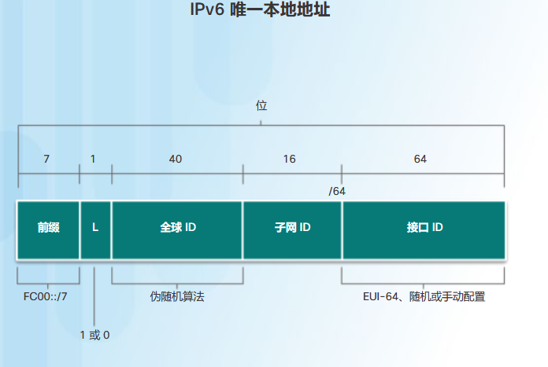
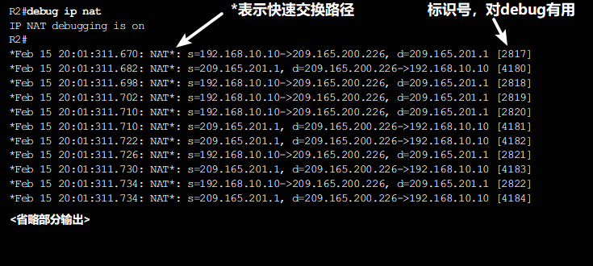

# NAT

公有IPv4地址有限, 为了节省地址发明. 内网流量传到外网, 通过路由器包装, 路由器会把NAT地址池中的一个地址拿来替换内网地址. 这样外网看来是一个公有地址在通讯. 

## NAT 操作

NAT有这些术语

* 内部地址: 经过NAT转换设备的地址
* 外部地址: 目标设备的地址
* 本地地址: 内网出现的地址
* 全局地址: 出现在外网

推广

* 内部本地: 内网出现的要被转换的地址
* 内部全局: 内网地址转换后的地址
* 外部本地: 目标设备的地址在内网的样子(不变)
* 外部全局: 目标设备的地址在外网的样子(==外部本地)

### 工作方式

* 内部主机使用内部本地地址发送一个数据包
* NAT路由器接到数据包
* NAT路由器吧数据包的内部本地地址替换为内部全局地址
* 发往外部全局地址
* 收到回信
* 把内部全局地址按照映射表转换为内部本地地址
* 发送回去

### NAT类型

* 静态NAT: 本地地址-全局地址, 一对一映射, 永久的, 除非手动更改.

* 动态NAT: 多对多. 100内部, 10个全局, 可以按需转换. 如果NAT池耗尽, 其他的接入就要等待

  静态/动态NAT工作流程

  * 发起会话
  * 路由器的一个端口上接收到数据包, 如果应用了NAT, 就检查数据包的内部地址, 如果满足条件, 就进行转换
  * 收到数据包时根据记录的映射进行转换

* 端口地址转换PAT: 多对一. 根据端口转发. 重复次数高达65536次

  一般来说只有一个内部全局地址.

  通信流程

  * 发起TCP/IP会话
  * 生成一个 TCP 或 UDP 源端口值或专门为 ICMP 分配的查询 ID来标记会话
  * 用端口号确定转发

  如果源端口别占用, 会从相应端口组( 0–511、512–1023 或 1024–65535 )分配第一个可用的端口号. **新的端口号是对于内部全局地址而言的, 内部本地地址不必更改端口号**. 收到数据包的时候, 会根据映射表把端口号和ip都进行转换.

  

### NAT优势

* 节省地址
* 增强连接公网的灵活性, 可以实施多池/备用池/负载均衡池
* 更改公共IPv4地址不必对本地地址重新编址, 为内部网络编址方案提供了一致性 
* 隐藏内部地址

### NAT缺陷

* 转发延迟
* 端到端编址的丢失, 与目的IPv4地址有关的协议将不可用. 例如数字签名
* 端到端IPv4可追溯性缺失, 排除故障困难
* 隧道协议复杂. IPsec不可用

* 外网发起的TCP链接的一些服务或无状态协议可能中断

## 配置NAT

### 静态NAT

配置 192.168.10.254 映射到 209.165.201.5 

```
(config)
ip nat inside source static 192.168.10.254 209.168.201.5 // 静态nat映射
interface s0/0/0
(config-if)
ip addr 192.168.1.2 255.255.255.252 // 分配端口ip
ip nat inside // 配置为nat内部接口
exit
(config)
inter s0/1/0
(config-if)
ip addr 209.165.200.1 255.255.255.252
ip nat outside
```

验证NAT

```
clear ip nat statistics // 先清空NAT统计信息
show ip nat translations // 清空后是没有转换的, 如果一段时间后看到了转换, 说明NAT成功建立
```


### 动态NAT

```
(config)
ip nat pool NAT-POOL-NAME 209.168.200.226 209.168.200.240 netmask 255.255.255.224 // 地址池
access-list 1 permit 192.168.0.0 0.0.255.255 // 建立ACL 1
ip nat inside source list 1 pool NAT-POOL-NAME // 把 nat pool 和 ACL 1 绑定
inter s0/0/0
(config-if)
ip nat inside
inter s0/1/0
ip nat outside
```

验证NAT

```
(en)
show ip nat translations verbose // 加上verbose查看详细信息, 包括过期时间
ip nat translation timeout timeout-seconds // 设定过期时间(默认1天)
clear ip nat translation inside [内部全局ip] [内部本地ip] {可选: global [外部本地ip] [外部全局ip]} // 清除一个动态转换条目
clear ip nat translation protocol inside [内部全局ip] [内部全局port] [内部本地ip] [内部本地port] {可选: global [外部本地ip] [外部本地port] [外部全局ip] [外部全局port]} // 清楚一个PAT
clear ip nat translation * // 加上*清楚所有动态条目
```

### PAT

PAT可以是地址池可以是一个地址

```
ip nat pool POOL-1 209.168.200.226 209.165.200.240 netmask 255.255.255.224
access-list 1 permit 192.168.0.0 0.0.255.255 // 建立ACL 1
ip nat inside source list 1 pool POOL-1 overload // 注意关键词overload
inter s0/0/0
(config-if)
ip nat inside
inter s0/1/0
ip nat outside
```

### 端口转发

为了在点对点传输中, 让外部客户机访问内网的服务器, 用端口转发, 把特定请求转发到内部的特定端口.

例如: 

外部用户想访问内网的web服务器

* 外部用户向80端口发送请求
* 路由器接收到80端口的请求, 把它转发到内部的192.168.1.100:8080主机
* 内部主机接受请求并且应答

配置

```
ip nat inside source static tcp 192.168.10.254 80 209.165.200.225 8080
inter s0/0/0
ip nat inside
inter s0/1/0
ip nat outside
```

### NAT和IPv6

IPv6唯一本地地址(ULA), 为本地站点的通信提供IPv6地址空间, **前缀FC00::/7**, 第8位是0或1, 如果前缀是本地分配的, 第8位就是1. 这样前缀就是**FD00/8**



* 允许站点合并, 私下互联
* 独立于ISP, 不可进行互联网链接
* 不可同通过互联网路由

IPv6的NAT用来提供仅支持IPv6和仅支持IPv4的网络之间的访问, 不是地址转换.

## 故障排除

### NAT故障排除命令

**步骤 1.**根据配置，清楚地确定应该实现什么样的 NAT。这可能会揭示出配置问题。

**步骤 2.**使用 **show ip nat translations** 命令验证转换表中转换条目是否正确。

* 如果内外接口弄反了

  ```
  inter s0/0/0
  no ip nat outside
  ip nat inside
  ```

  使用**show access-lists**检查ACL配置

  ```
  show access-lists
  no access-list 1
  access-list 1 permit ...
  ```

  

**步骤 3.**使用 **clear** 和 **debug** 命令验证 NAT 是否如预期一样工作。检查动态条目被清除后，是否又被重新创建出来。

```
debug ip nat
```



**步骤 4.**详细审查数据包传送情况，确认路由器具有移动数据包所需的正确路由信息。